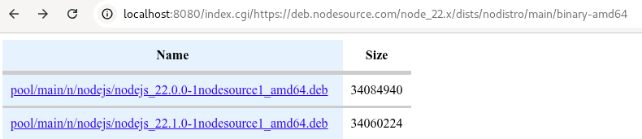

## debbrowser

Debian repository browser (application), which works even for hidden repositories.

(Note that https://deb.nodesource.com/node_22.x/dists/nodistro/main/binary-amd64 is not indexable.)

## Installation

Just put this repository to a webserver.

For even more conveniense, you can cd to this directory and run `./lighttpd.conf`.

## Demo?

Sorry I cannot setup a demo server as Packages.gz access log from that demo server will be recorded to the apt repository.

## Why you chose deprecated CGI?

CGI is still universal way.

I once wrote https://github.com/cielavenir/openrave_sample_app, which uses django, but it is not compatible anymore, which is trajedic.

Using CGI, the software compatibility is kept longer.
